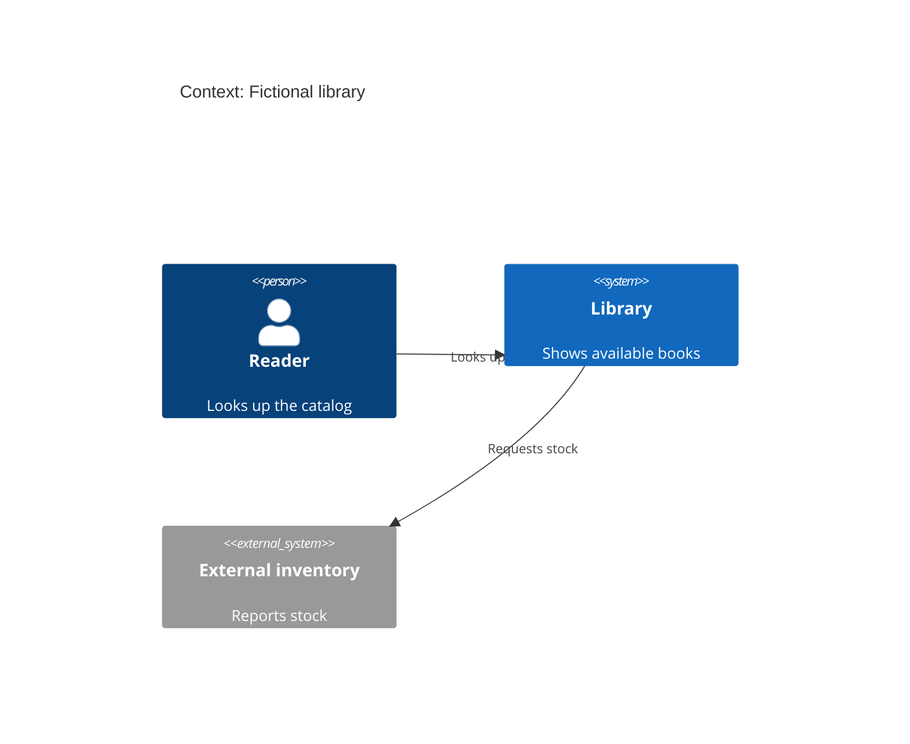
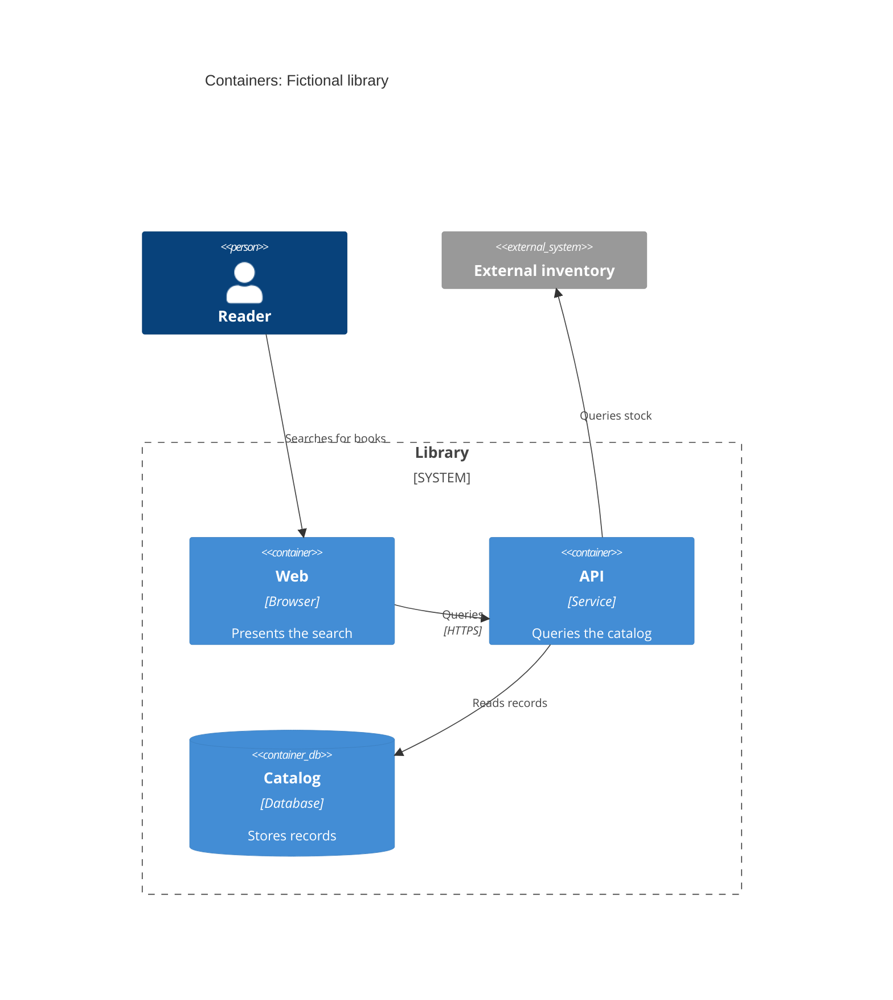
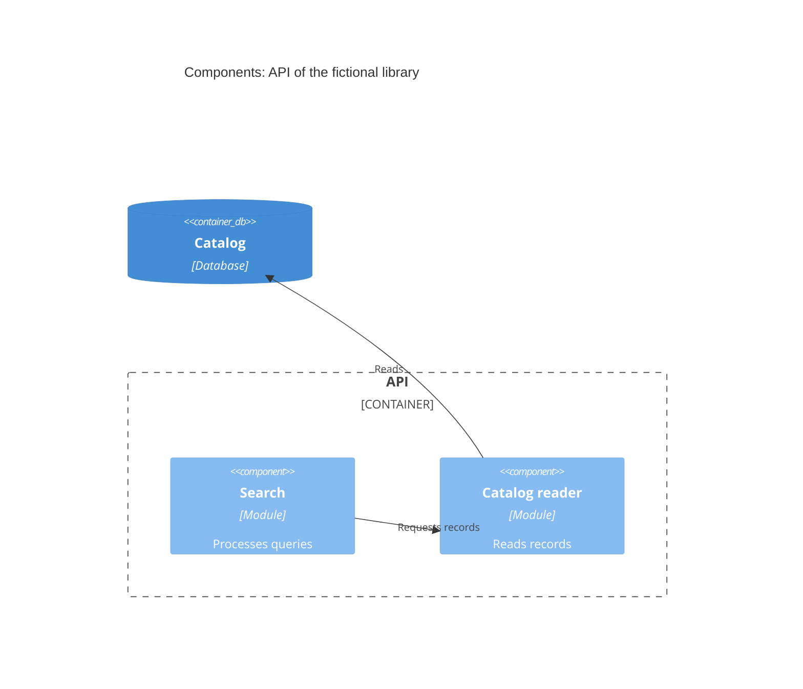

# C4 and diagram engines

Use C4 when the question is structural. The three levels answer different questions; do not invent components to fill levels. The [fictional flow](../assets/example-flow.md) serves a question that does not need C4.

| Question | Level and scope |
|---|---|
| Who uses the system, and which other systems does it relate to? | Context (level 1): one system as a box, people and external systems. |
| Which applications, services and stores make it up? | Containers (level 2): deployable or runnable units inside its boundary. A repository is not necessarily a container. |
| How is a complex container organized inside? | Components (level 3): modules with a relevant responsibility and relationships; one view per container that justifies it. |

## Choosing an engine and a renderer

| Engine | When to choose it | Delivery |
|---|---|---|
| Embedded Mermaid C4 (default) | A Markdown source reviewable next to the text; a local viewer with C4 support is available, or the source is read without rendering. | `mermaid` blocks in Markdown; no extra DSL needed. Check the viewer's C4 support before promising an embedded render. |
| Structurizr DSL | A formal dossier: model and views kept apart, several coherent views, or reuse of the model. | `workspace.dsl` plus a Markdown explanation; an auxiliary Mermaid view may be added only if it helps local reading. Needs a compatible local tool to validate and render. |

By default render locally and check legibility, orientation and relationships; with no renderer, deliver the editable source. A preview through a remote renderer such as `mermaid.ink` is generated or opened **only** with explicit consent about the destination and the source transmitted: the URL carries the diagram code and sends it to an external service. Never add it by default, not even as a stand-in for a missing local render. The same limit applies to pasting DSL into web services.

## Mermaid C4 templates

Replace the fictional labels with observed names, and document the support for each important relationship. Keep stable identifiers, readable names and relationship verbs; state a protocol only when it has been checked. Do not include tokens, private hosts or personal data.

### Level 1: context



### Level 2: containers



### Level 3: components of one container



Skip level 3 when there is no internal complexity to explain. A Mermaid sequence can complement level 2 for a critical interaction; it does not replace the structural model and is not added by routine.

## Structurizr DSL template

Model and views of the same fictional library; add components only if the container justifies them. Validate with a local tool before claiming it renders.

```dsl
workspace "Fictional library" "Catalog lookup" {
  model {
    reader = person "Reader" "Looks up the catalog"
    library = softwareSystem "Library" "Shows available books" {
      web = container "Web" "Presents the search" "Browser"
      api = container "API" "Queries the catalog" "Service" {
        search = component "Search" "Processes queries"
        catalogReader = component "Catalog reader" "Reads records"
      }
      catalog = container "Catalog" "Stores records" "Database" "Database"
    }
    inventory = softwareSystem "External inventory" "Reports stock"
    reader -> web "Searches for books"
    web -> api "Queries" "HTTPS"
    api -> catalog "Reads records"
    api -> inventory "Queries stock"
    search -> catalogReader "Requests records"
    catalogReader -> catalog "Reads"
  }
  views {
    systemContext library "Context" {
      include *
      autoLayout lr
    }
    container library "Containers" {
      include *
      autoLayout lr
    }
    component api "ApiComponents" {
      include *
      autoLayout lr
    }
  }
}
```

Note next to the diagram the date, the sources read, the verified relationships and the hypotheses. Review boundaries and directions with the person; do not attribute the examples in this guide to real code.
