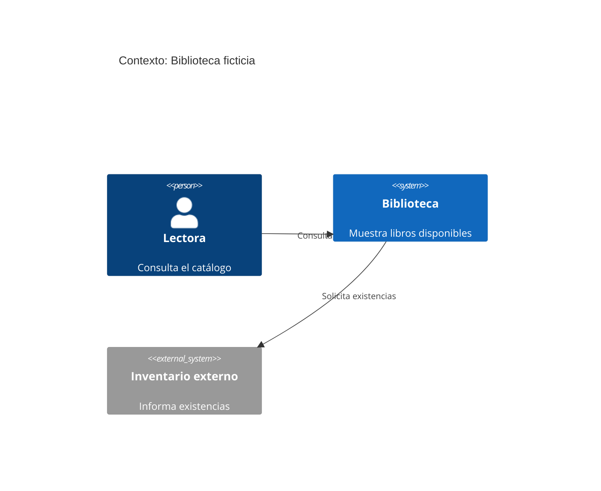
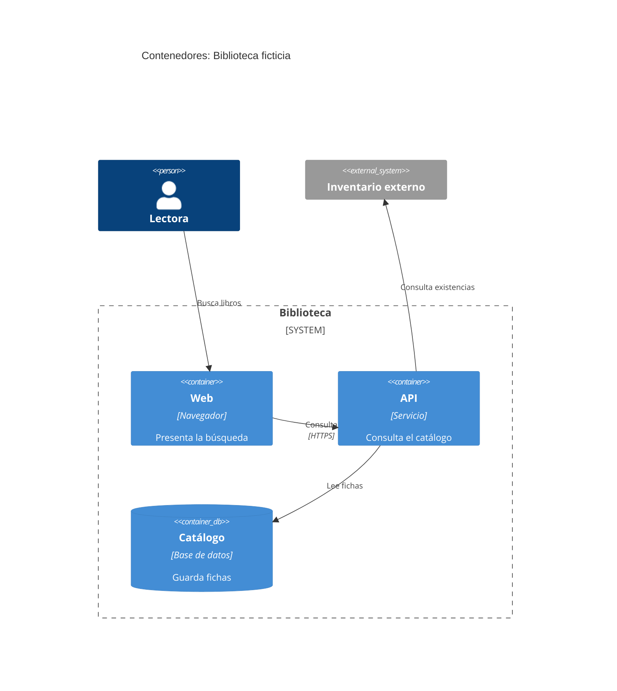
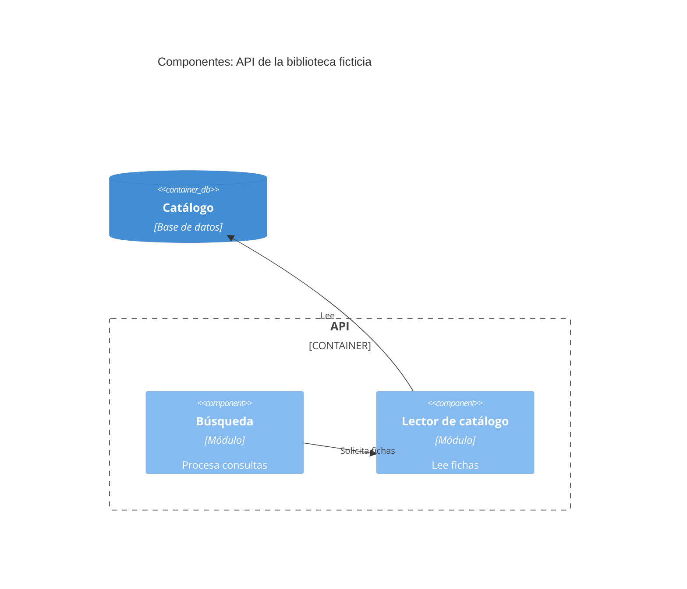

# C4 y motores de diagramas

Usa C4 cuando la pregunta sea estructural. Los tres niveles responden preguntas distintas; no inventes componentes para rellenar niveles. El [flujo ficticio](../assets/ejemplo-flujo.md) sirve para una pregunta que no necesita C4.

| Pregunta | Nivel y alcance |
|---|---|
| ¿Quién utiliza el sistema y con qué otros sistemas se relaciona? | Contexto (nivel 1): un sistema como caja, personas y sistemas externos. |
| ¿Qué aplicaciones, servicios y almacenes lo forman? | Contenedores (nivel 2): unidades desplegables o ejecutables dentro de su límite. Un repositorio no equivale necesariamente a un contenedor. |
| ¿Cómo se organiza internamente un contenedor complejo? | Componentes (nivel 3): módulos con responsabilidad y relaciones relevantes; una vista por contenedor que lo justifique. |

## Elegir motor y render

| Motor | Elección | Entrega |
|---|---|---|
| Mermaid C4 embebido (por defecto) | Una fuente Markdown revisable junto al texto; visor local compatible con C4 disponible o lectura de la fuente sin render. | Bloques `mermaid` en Markdown; no exige DSL adicional. Comprueba soporte C4 del visor antes de prometer render embebido. |
| Structurizr DSL | Dossier formal: modelo y vistas por separado, varias vistas coherentes o reutilización del modelo. | `workspace.dsl` y una explicación Markdown; puede añadirse una vista Mermaid auxiliar sólo si facilita lectura local. Requiere herramienta local compatible para validar/renderizar. |

Por defecto renderiza localmente y revisa legibilidad, orientación y relaciones; si no hay renderizador, entrega la fuente editable. Una vista previa con un renderizador remoto como `mermaid.ink` **sólo** se genera o abre con consentimiento explícito sobre destino y fuente transmitida: la URL incluye el código del diagrama y lo envía a un servicio externo. Nunca la añadas por defecto, ni siquiera como sustituto de un render local ausente. El mismo límite aplica al pegar DSL en servicios web.

## Plantillas Mermaid C4

Sustituye las etiquetas ficticias con nombres observados y documenta el respaldo de cada relación importante. Mantén identificadores estables, nombres legibles y verbos de relación; indica protocolo sólo si está comprobado. No incluyas tokens, hosts privados ni datos personales.

### Nivel 1: contexto



### Nivel 2: contenedores



### Nivel 3: componentes de un contenedor



Omite el nivel 3 si no hay complejidad interna que explicar. Una secuencia Mermaid puede complementar el nivel 2 para una interacción crítica; no reemplaza el modelo estructural ni se agrega por rutina.

## Plantilla Structurizr DSL

Modelo y vistas de la misma biblioteca ficticia; completa componentes sólo si el contenedor los justifica. Valida con una herramienta local antes de declarar que renderiza.

```dsl
workspace "Biblioteca ficticia" "Consulta de catálogo" {
  model {
    lectora = person "Lectora" "Consulta el catálogo"
    biblioteca = softwareSystem "Biblioteca" "Muestra libros disponibles" {
      web = container "Web" "Presenta la búsqueda" "Navegador"
      api = container "API" "Consulta el catálogo" "Servicio" {
        busqueda = component "Búsqueda" "Procesa consultas"
        lector = component "Lector de catálogo" "Lee fichas"
      }
      catalogo = container "Catálogo" "Guarda fichas" "Base de datos" "Database"
    }
    inventario = softwareSystem "Inventario externo" "Informa existencias"
    lectora -> web "Busca libros"
    web -> api "Consulta" "HTTPS"
    api -> catalogo "Lee fichas"
    api -> inventario "Consulta existencias"
    busqueda -> lector "Solicita fichas"
    lector -> catalogo "Lee"
  }
  views {
    systemContext biblioteca "Contexto" {
      include *
      autoLayout lr
    }
    container biblioteca "Contenedores" {
      include *
      autoLayout lr
    }
    component api "ComponentesAPI" {
      include *
      autoLayout lr
    }
  }
}
```

Anota junto al diagrama fecha, fuentes consultadas, relaciones comprobadas e hipótesis. Revisa límites y direcciones con la persona; no atribuyas a código real los ejemplos de esta guía.
